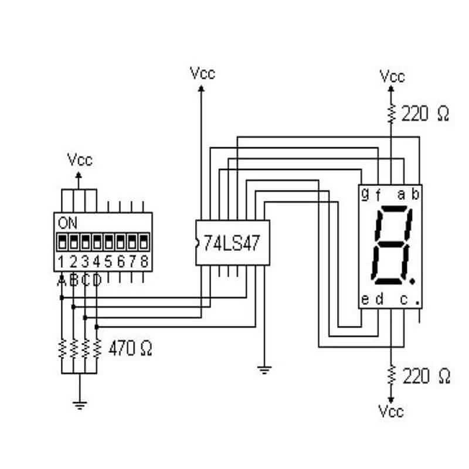

# Binary-Counter

Count up a 7-Segment display in binary using a dip-switch

Materials used:
- Breadboard
- Jumpers
- Dip-Switch
- 7-Segment Display
- SN74LS47N

[^1]

[^1]: https://www.google.com/url?sa=i&url=https%3A%2F%2Fuelectronics.com%2Fproducto%2F74ls47-decodificador-ttl-sn74ls47n%2F&psig=AOvVaw0Av9rhZJcZ-DYoe_O0-Mlr&ust=1720493636326000&source=images&cd=vfe&opi=89978449&ved=0CBEQjRxqFwoTCICewbS4locDFQAAAAAdAAAAABAg
